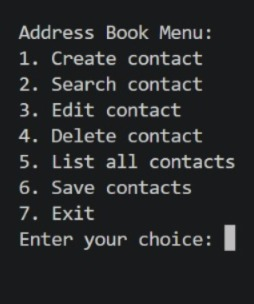
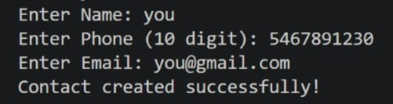
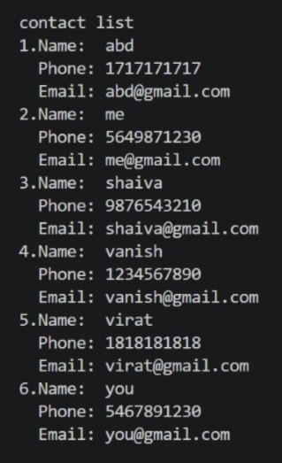

# 📇 Address Book in C

🚀 A console-based Address Book application built using C that allows users to efficiently manage contacts with file storage support.

---

## 🔍 Overview

This project demonstrates how to build a real-world application using C programming concepts like structures, file handling, and modular design. It allows users to perform complete contact management operations such as adding, searching, editing, and deleting records.

---

## ✨ Features

- Add new contact  
- View all contacts  
- Search contact by name  
- Edit existing contact  
- Delete contact  
- Persistent storage using CSV file  

---

## 🛠️ Technologies Used

- C Programming  
- Structures  
- File Handling  

---

## ▶️ How to Run

### Compile
```bash
gcc main.c file.c contact.c populate.c -o addressbook
```

### Run
```bash
./addressbook
```

---

## 📸 Output

### 📌 Menu


### 📌 Create Contact


### 📌 Display Contacts


---

## 📁 Project Structure

```
main.c
file.c
file.h
contact.c
contact.h
populate.c
populate.h
contacts.csv
```

---

## 📖 Key Learning Outcomes

- Implemented CRUD operations in C  
- Used file handling for persistent data storage  
- Designed modular code using multiple source files  
- Improved understanding of structures and data management  

---

## 👨‍💻 Author

**Vanish B H**

- GitHub: https://github.com/VanishBH  
- LinkedIn: https://www.linkedin.com/in/vanish-b-h-87914934a  
